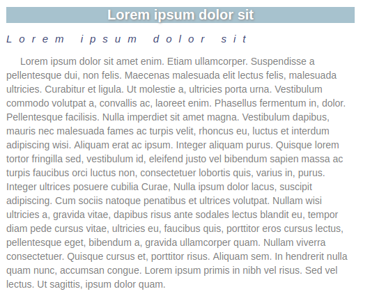

# CSS &ndash; styling text

## Exercise

Create a **div** element, and within it make the following elements:

  * **h1**,
  * **h2**,
  * **p**.

Copy a piece of sample text from [lipsum.com](https://lipsum.com/) and paste it into the paragraph. Complete the text in the headings as well. Then, style the element according to the picture below and the specification.

## Specification
* font for all elements: Verdana, Arial, sans-serif;
* **div**
  * width: 500px;
* **h1**
	* background color: #ACC4CE,
	* text color: white,
	* font size: 20px,
	* shadow color: #878787,
* **h2**
  * text color: #395075,
  * letter-spacing: 10px,
* **p**
  * text color: grey,
  * font size: 14px,
  *	line height: 20px,
  *	text-indent: 20px.

---

## Useful tool
    [shadow generator](https://www.cssportal.com/css3-text-shadow-generator/)

## Attention
Try to best illustrate the example, pay attention to details, including the shadow in **h1** and text inclination in **h2**. Not everything is described in the specifications above.
Use element and class selectors. Do not use id selectors.

Write styles in **style.css**, do not use inline styles.

## Need help or inspiration?
* [Why should we declare more than one font?](https://developer.mozilla.org/en-US/docs/Web/CSS/font-family)
* [How to add shadows to the text?](https://css-tricks.com/almanac/properties/t/text-shadow/)
* [What is inheriting?](https://developer.mozilla.org/en-US/docs/Web/CSS/inheritance)
* HTML and CSS &ndash; prework
